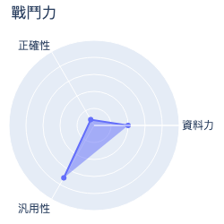
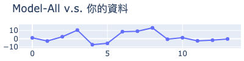
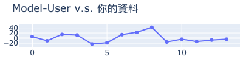
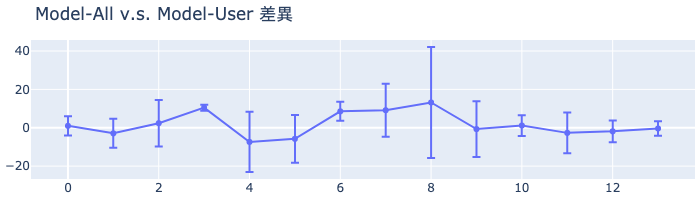

# MakerClub 咖啡粉偵測儀活動成績單 
| 活動時間: 2020/11/18<br>參加人名稱: **001**<br>模型名稱: **mlp** |  |
|-----:|-------------:|
## 資料能力：
> 資料分數:87.66
>
> 排名:19/35 (*1)
### 貢獻訓練資料量:
> 	[★★★★★★★★★★★★★★☆☆☆☆☆☆☆☆☆☆☆☆☆☆☆☆☆☆☆☆☆]-(14/35)
### 資料對模型的乖離排名:
> 	[★★★☆☆☆☆☆☆☆☆☆☆☆☆☆☆☆☆☆]-(3/20) (*2)
>
> 	平均誤差值: 1.065
>
> 	誤差值標準差: 17.595
>
> 	誤差值全體學員平均標準差: 10.791
### 模型誤差圖(*3):
> 	|
### 模型能力差異
> 
### 量測資料
|    | id   |   rr |   rg |   rb |   rc |   value |
|---:|:-----|-----:|-----:|-----:|-----:|--------:|
|  0 | N1   |   87 |  118 |  105 |  339 |    72   |
|  1 | N2   |  102 |  127 |  109 |  369 |    90.2 |
|  2 | N3   |   78 |  112 |  101 |  321 |    62.4 |
|  3 | N6   |   89 |  119 |  103 |  341 |    66.5 |
|  4 | N10  |  119 |  139 |  116 |  407 |   104   |
|  5 | X07  |  114 |  138 |  116 |  401 |    98.6 |
|  6 | X11  |   87 |  118 |  105 |  341 |    64.5 |
|  7 | X13  |   79 |  115 |  104 |  328 |    53.8 |
|  8 | X16  |   62 |  103 |   97 |  291 |    32.2 |
|  9 | R3   |  115 |  137 |  115 |  400 |    96   |
| 10 | R6   |   99 |  125 |  108 |  363 |    83.7 |
| 11 | B3   |  104 |  127 |  108 |  363 |    93.4 |
| 12 | B6   |   97 |  123 |  105 |  356 |    87   |
| 13 | B9   |   96 |  123 |  106 |  356 |    83.4 |
## 附錄
* 模型評估說明：
  - 評估時，將對每位學員個別製作兩個模型，分別為：全體參加學員的資料訓練的模型(**Model-All**)與僅不使用你的資料去訓練的模型(**Model-User**)。
  - 假設**Model-All**對你貢獻的資料的平均誤差是6，而**Model-User**的平均誤差是11(大於6)，就表示你的資料對於模型的泛化能力有較高的機會提供了正向貢獻。
```
(*1) : 資料分數為你收集的資料對於整體模型的影響程度，越高分表示影響程度越高。
(*2) : 乖離排名的計算是由上述兩個模型分別進行預測，利用所得到的平均絕對誤差的差值做排名。
(*3) : 誤差值是模型對於你的資料所預測出來的數值與CM-100所測得的誤差。
```
