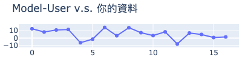

# MakerClub 咖啡粉偵測儀活動成績單 
| 活動時間: 2020/11/18<br>參加人名稱: **002**<br>模型名稱: **regression** |  |
|-----:|-------------:|
## 資料能力：
> 資料分數:92.18
>
> 排名:17/35 (*1)
### 貢獻訓練資料量:
> 	[★★★★★★★★★★★★★★★★★☆☆☆☆☆☆☆☆☆☆☆☆☆☆☆☆☆☆]-(17/35)
### 資料對模型的乖離排名:
> 	[★★★★★★★★★★★★★★★★★☆☆☆]-(17/20) (*2)
>
> 	平均誤差值: 5.488
>
> 	誤差值標準差: 6.485
>
> 	誤差值全體學員平均標準差: 6.525
### 模型誤差圖(*3):
> 	|
### 模型能力差異
> 
### 量測資料
|    | id   |   rr |   rg |   rb |   rc |   value |
|---:|:-----|-----:|-----:|-----:|-----:|--------:|
|  0 | N1   |  121 |  151 |  134 |  442 |    72   |
|  1 | N5   |  100 |  139 |  127 |  401 |    56.9 |
|  2 | N6   |  114 |  148 |  132 |  430 |    66.5 |
|  3 | N8   |  146 |  168 |  142 |  495 |    87.3 |
|  4 | N10  |  161 |  178 |  148 |  526 |   104   |
|  5 | X07  |  147 |  174 |  150 |  510 |    98.6 |
|  6 | X11  |  117 |  151 |  134 |  438 |    64.5 |
|  7 | X13  |   97 |  141 |  133 |  406 |    53.8 |
|  8 | X14  |  108 |  146 |  132 |  422 |    56.1 |
|  9 | X16  |   84 |  132 |  155 |  375 |    32.2 |
| 10 | R3   |  148 |  169 |  143 |  498 |    96   |
| 11 | R6   |  131 |  158 |  138 |  464 |    83.7 |
| 12 | B2   |  118 |  150 |  135 |  438 |    88.6 |
| 13 | B3   |  137 |  160 |  137 |  471 |    93.4 |
| 14 | B6   |  128 |  155 |  134 |  454 |    87   |
| 15 | B8   |  137 |  163 |  142 |  480 |    94.2 |
| 16 | B9   |  124 |  154 |  138 |  452 |    83.4 |
## 附錄
* 模型評估說明：
  - 評估時，將對每位學員個別製作兩個模型，分別為：全體參加學員的資料訓練的模型(**Model-All**)與僅不使用你的資料去訓練的模型(**Model-User**)。
  - 假設**Model-All**對你貢獻的資料的平均誤差是6，而**Model-User**的平均誤差是11(大於6)，就表示你的資料對於模型的泛化能力有較高的機會提供了正向貢獻。
```
(*1) : 資料分數為你收集的資料對於整體模型的影響程度，越高分表示影響程度越高。
(*2) : 乖離排名的計算是由上述兩個模型分別進行預測，利用所得到的平均絕對誤差的差值做排名。
(*3) : 誤差值是模型對於你的資料所預測出來的數值與CM-100所測得的誤差。
```
