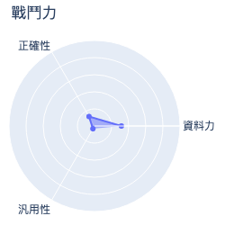
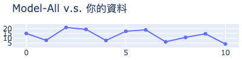
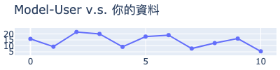
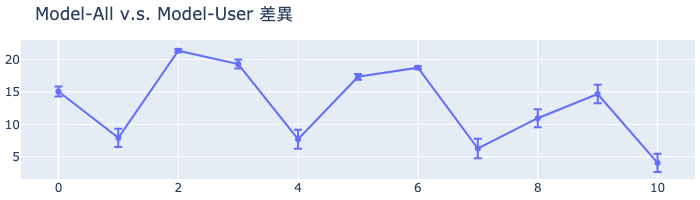

# MakerClub 咖啡粉偵測儀活動成績單 
| 活動時間: 2020/11/18<br>參加人名稱: **003**<br>模型名稱: **mlp** |  |
|-----:|-------------:|
## 資料能力：
> 資料分數:98.77
>
> 排名:10/35 (*1)
### 貢獻訓練資料量:
> 	[★★★★★★★★★★★☆☆☆☆☆☆☆☆☆☆☆☆☆☆☆☆☆☆☆☆☆☆☆☆]-(11/35)
### 資料對模型的乖離排名:
> 	[★★★★★★★★★★★★★★★★★★★★]-(20/20) (*2)
>
> 	平均誤差值: 14.026
>
> 	誤差值標準差: 5.224
>
> 	誤差值全體學員平均標準差: 10.791
### 模型誤差圖(*3):
> 	|
### 模型能力差異
> 
### 量測資料
|    | id   |   rr |   rg |   rb |   rc |   value |
|---:|:-----|-----:|-----:|-----:|-----:|--------:|
|  0 | N1   |   94 |  117 |  101 |  348 |    72   |
|  1 | N2   |  111 |  127 |  106 |  381 |    90.2 |
|  2 | N5   |   85 |  112 |   98 |  331 |    56.9 |
|  3 | N6   |   94 |  118 |  102 |  350 |    66.5 |
|  4 | B7   |  120 |  133 |  109 |  401 |    91.9 |
|  5 | X11  |   91 |  117 |  102 |  347 |    64.5 |
|  6 | X12  |   87 |  114 |  101 |  338 |    59.3 |
|  7 | R4   |  122 |  134 |  110 |  405 |    93.9 |
|  8 | B5   |  110 |  126 |  105 |  379 |    87.1 |
|  9 | R6   |  113 |  129 |  108 |  388 |    83.7 |
| 10 | B8   |  110 |  125 |  103 |  376 |    94.2 |
## 附錄
* 模型評估說明：
  - 評估時，將對每位學員個別製作兩個模型，分別為：全體參加學員的資料訓練的模型(**Model-All**)與僅不使用你的資料去訓練的模型(**Model-User**)。
  - 假設**Model-All**對你貢獻的資料的平均誤差是6，而**Model-User**的平均誤差是11(大於6)，就表示你的資料對於模型的泛化能力有較高的機會提供了正向貢獻。
```
(*1) : 資料分數為你收集的資料對於整體模型的影響程度，越高分表示影響程度越高。
(*2) : 乖離排名的計算是由上述兩個模型分別進行預測，利用所得到的平均絕對誤差的差值做排名。
(*3) : 誤差值是模型對於你的資料所預測出來的數值與CM-100所測得的誤差。
```
