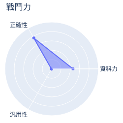
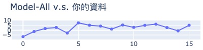
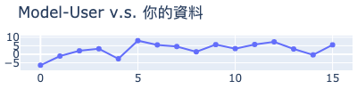
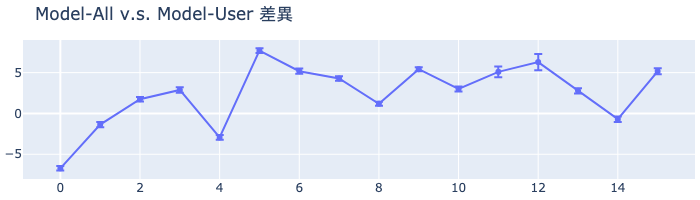

# MakerClub 咖啡粉偵測儀活動成績單 
| 活動時間: 2020/11/18<br>參加人名稱: **005**<br>模型名稱: **poly** |  |
|-----:|-------------:|
## 資料能力：
> 資料分數:99.42
>
> 排名:3/35 (*1)
### 貢獻訓練資料量:
> 	[★★★★★★★★★★★★★★★★☆☆☆☆☆☆☆☆☆☆☆☆☆☆☆☆☆☆☆]-(16/35)
### 資料對模型的乖離排名:
> 	[★★★★★★☆☆☆☆☆☆☆☆☆☆☆☆☆☆]-(6/20) (*2)
>
> 	平均誤差值: 2.802
>
> 	誤差值標準差: 3.747
>
> 	誤差值全體學員平均標準差: 9.005
### 模型誤差圖(*3):
> 	|
### 模型能力差異
> 
### 量測資料
|    | id   |   rr |   rg |   rb |   rc |   value |
|---:|:-----|-----:|-----:|-----:|-----:|--------:|
|  0 | N1   |  120 |  163 |  155 |  483 |    72   |
|  1 | N2   |  154 |  185 |  168 |  555 |    90.2 |
|  2 | N3   |  120 |  164 |  157 |  487 |    62.4 |
|  3 | N5   |  116 |  162 |  156 |  479 |    56.9 |
|  4 | N6   |  120 |  164 |  156 |  486 |    66.5 |
|  5 | N7   |  146 |  180 |  166 |  539 |    76.8 |
|  6 | N8   |  162 |  191 |  172 |  574 |    87.3 |
|  7 | N9   |  178 |  200 |  176 |  604 |    98.8 |
|  8 | N10  |  196 |  212 |  183 |  642 |   104   |
|  9 | X10  |  142 |  180 |  167 |  537 |    73.9 |
| 10 | X12  |  121 |  167 |  160 |  494 |    59.3 |
| 11 | X15  |  107 |  159 |  154 |  465 |    40.9 |
| 12 | X16  |   98 |  152 |  149 |  443 |    32.2 |
| 13 | R5   |  152 |  183 |  167 |  550 |    85.5 |
| 14 | B3   |  158 |  186 |  168 |  559 |    93.4 |
| 15 | B5   |  157 |  185 |  168 |  557 |    87.1 |
## 附錄
* 模型評估說明：
  - 評估時，將對每位學員個別製作兩個模型，分別為：全體參加學員的資料訓練的模型(**Model-All**)與僅不使用你的資料去訓練的模型(**Model-User**)。
  - 假設**Model-All**對你貢獻的資料的平均誤差是6，而**Model-User**的平均誤差是11(大於6)，就表示你的資料對於模型的泛化能力有較高的機會提供了正向貢獻。
```
(*1) : 資料分數為你收集的資料對於整體模型的影響程度，越高分表示影響程度越高。
(*2) : 乖離排名的計算是由上述兩個模型分別進行預測，利用所得到的平均絕對誤差的差值做排名。
(*3) : 誤差值是模型對於你的資料所預測出來的數值與CM-100所測得的誤差。
```
