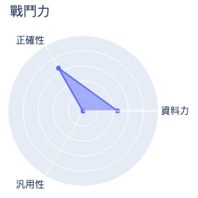

# MakerClub 咖啡粉偵測儀活動成績單 
| 活動時間: 2020/11/18<br>參加人名稱: **006**<br>模型名稱: **poly** |  |
|-----:|-------------:|
## 資料能力：
> 資料分數:99.53
>
> 排名:2/35 (*1)
### 貢獻訓練資料量:
> 	[★★★★★★★★★★★★★★★★☆☆☆☆☆☆☆☆☆☆☆☆☆☆☆☆☆☆☆]-(16/35)
### 資料對模型的乖離排名:
> 	[★★★★★★★★★★★★★★☆☆☆☆☆☆]-(14/20) (*2)
>
> 	平均誤差值: -1.327
>
> 	誤差值標準差: 7.587
>
> 	誤差值全體學員平均標準差: 9.005
### 模型誤差圖(*3):
> 	|
### 模型能力差異
> 
### 量測資料
|    | id   |   rr |   rg |   rb |   rc |   value |
|---:|:-----|-----:|-----:|-----:|-----:|--------:|
|  0 | N2   |  138 |  180 |  171 |  543 |    90.2 |
|  1 | N3   |  129 |  175 |  170 |  527 |    62.4 |
|  2 | N5   |  112 |  165 |  163 |  492 |    56.9 |
|  3 | N6   |  134 |  179 |  172 |  531 |    66.5 |
|  4 | N7   |  137 |  181 |  174 |  547 |    76.8 |
|  5 | X07  |  180 |  209 |  190 |  639 |    98.6 |
|  6 | X14  |  141 |  189 |  181 |  568 |    56.1 |
|  7 | X15  |  107 |  165 |  165 |  489 |    40.9 |
|  8 | X16  |  103 |  164 |  165 |  489 |    32.2 |
|  9 | R1   |  203 |  223 |  197 |  684 |   108.2 |
| 10 | R1   |  203 |  223 |  197 |  684 |   105.4 |
| 11 | R3   |  179 |  206 |  187 |  631 |    96   |
| 12 | B1   |  160 |  192 |  177 |  586 |    92.9 |
| 13 | B2   |  192 |  216 |  192 |  660 |    88.6 |
| 14 | B7   |  172 |  202 |  184 |  616 |    91.9 |
| 15 | B9   |  152 |  188 |  176 |  572 |    83.4 |
## 附錄
* 模型評估說明：
  - 評估時，將對每位學員個別製作兩個模型，分別為：全體參加學員的資料訓練的模型(**Model-All**)與僅不使用你的資料去訓練的模型(**Model-User**)。
  - 假設**Model-All**對你貢獻的資料的平均誤差是6，而**Model-User**的平均誤差是11(大於6)，就表示你的資料對於模型的泛化能力有較高的機會提供了正向貢獻。
```
(*1) : 資料分數為你收集的資料對於整體模型的影響程度，越高分表示影響程度越高。
(*2) : 乖離排名的計算是由上述兩個模型分別進行預測，利用所得到的平均絕對誤差的差值做排名。
(*3) : 誤差值是模型對於你的資料所預測出來的數值與CM-100所測得的誤差。
```
