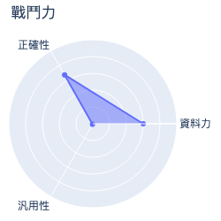
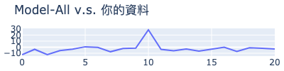
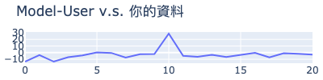
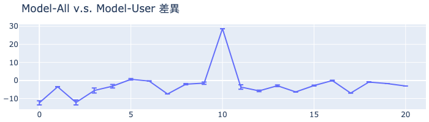

# MakerClub 咖啡粉偵測儀活動成績單 
| 活動時間: 2020/11/18<br>參加人名稱: **007**<br>模型名稱: **poly** |  |
|-----:|-------------:|
## 資料能力：
> 資料分數:98.93
>
> 排名:7/35 (*1)
### 貢獻訓練資料量:
> 	[★★★★★★★★★★★★★★★★★★★★★☆☆☆☆☆☆☆☆☆☆☆☆☆☆]-(21/35)
### 資料對模型的乖離排名:
> 	[★★★★★★★★★★★★★☆☆☆☆☆☆☆]-(13/20) (*2)
>
> 	平均誤差值: -2.957
>
> 	誤差值標準差: 7.985
>
> 	誤差值全體學員平均標準差: 9.005
### 模型誤差圖(*3):
> 	|
### 模型能力差異
> 
### 量測資料
|    | id   |   rr |   rg |   rb |   rc |   value |
|---:|:-----|-----:|-----:|-----:|-----:|--------:|
|  0 | N1   |  125 |  175 |  169 |  517 |    72   |
|  1 | N2   |  168 |  204 |  186 |  612 |    90.2 |
|  2 | N3   |  116 |  169 |  165 |  499 |    62.4 |
|  3 | N5   |  118 |  171 |  167 |  506 |    56.9 |
|  4 | N6   |  131 |  180 |  172 |  532 |    66.5 |
|  5 | N7   |  151 |  193 |  179 |  575 |    76.8 |
|  6 | N8   |  168 |  204 |  186 |  611 |    87.3 |
|  7 | N9   |  176 |  209 |  187 |  626 |    98.8 |
|  8 | N10  |  201 |  225 |  196 |  678 |   104   |
|  9 | X10  |  146 |  192 |  180 |  569 |    73.9 |
| 10 | X11  |  177 |  208 |  187 |  626 |    64.5 |
| 11 | X12  |  125 |  178 |  172 |  524 |    59.3 |
| 12 | R1   |  207 |  230 |  200 |  693 |   108.2 |
| 13 | R1   |  207 |  230 |  200 |  693 |   105.4 |
| 14 | R4   |  167 |  202 |  183 |  605 |    93.9 |
| 15 | R5   |  158 |  196 |  180 |  587 |    85.5 |
| 16 | R6   |  160 |  198 |  182 |  592 |    83.7 |
| 17 | B3   |  163 |  198 |  180 |  594 |    93.4 |
| 18 | B5   |  161 |  196 |  180 |  589 |    87.1 |
| 19 | B7   |  174 |  208 |  187 |  622 |    91.9 |
| 20 | B8   |  172 |  204 |  184 |  613 |    94.2 |
## 附錄
* 模型評估說明：
  - 評估時，將對每位學員個別製作兩個模型，分別為：全體參加學員的資料訓練的模型(**Model-All**)與僅不使用你的資料去訓練的模型(**Model-User**)。
  - 假設**Model-All**對你貢獻的資料的平均誤差是6，而**Model-User**的平均誤差是11(大於6)，就表示你的資料對於模型的泛化能力有較高的機會提供了正向貢獻。
```
(*1) : 資料分數為你收集的資料對於整體模型的影響程度，越高分表示影響程度越高。
(*2) : 乖離排名的計算是由上述兩個模型分別進行預測，利用所得到的平均絕對誤差的差值做排名。
(*3) : 誤差值是模型對於你的資料所預測出來的數值與CM-100所測得的誤差。
```
