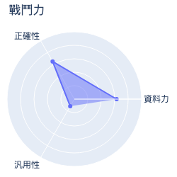
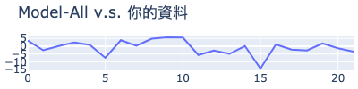
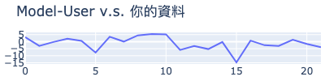
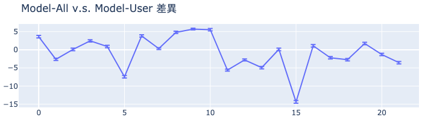

# MakerClub 咖啡粉偵測儀活動成績單 
| 活動時間: 2020/11/18<br>參加人名稱: **Alvin**<br>模型名稱: **regression** |  |
|-----:|-------------:|
## 資料能力：
> 資料分數:99.58
>
> 排名:2/35 (*1)
### 貢獻訓練資料量:
> 	[★★★★★★★★★★★★★★★★★★★★★★☆☆☆☆☆☆☆☆☆☆☆☆☆]-(22/35)
### 資料對模型的乖離排名:
> 	[★★★★☆☆☆☆☆☆☆☆☆☆☆☆☆☆☆☆]-(4/20) (*2)
>
> 	平均誤差值: -1.113
>
> 	誤差值標準差: 4.631
>
> 	誤差值全體學員平均標準差: 6.525
### 模型誤差圖(*3):
> 	|
### 模型能力差異
> 
### 量測資料
|    | id   |   rr |   rg |   rb |   rc |   value |
|---:|:-----|-----:|-----:|-----:|-----:|--------:|
|  0 | N1   |  145 |  181 |  174 |  561 |    72   |
|  1 | N2   |  163 |  193 |  180 |  598 |    90.2 |
|  2 | N3   |  126 |  169 |  166 |  520 |    62.4 |
|  3 | N5   |  124 |  170 |  167 |  520 |    56.9 |
|  4 | N6   |  132 |  173 |  167 |  531 |    66.5 |
|  5 | N7   |  133 |  172 |  166 |  530 |    76.8 |
|  6 | N8   |  168 |  196 |  181 |  609 |    87.3 |
|  7 | N10  |  192 |  213 |  191 |  663 |   104   |
|  8 | N11  |  174 |  197 |  180 |  615 |    93.6 |
|  9 | X07  |  199 |  222 |  199 |  688 |    98.6 |
| 10 | X14  |  128 |  173 |  170 |  530 |    56.1 |
| 11 | R1   |  188 |  210 |  190 |  655 |   108.2 |
| 12 | R1   |  188 |  210 |  190 |  655 |   105.4 |
| 13 | R3   |  169 |  197 |  182 |  613 |    96   |
| 14 | R4   |  172 |  197 |  184 |  616 |    93.9 |
| 15 | R5   |  138 |  176 |  171 |  545 |    85.5 |
| 16 | R6   |  159 |  190 |  179 |  591 |    83.7 |
| 17 | B1   |  166 |  194 |  179 |  603 |    92.9 |
| 18 | B3   |  165 |  193 |  178 |  599 |    93.4 |
| 19 | B7   |  174 |  200 |  187 |  622 |    91.9 |
| 20 | B8   |  166 |  192 |  177 |  598 |    94.2 |
| 21 | B9   |  150 |  184 |  174 |  569 |    83.4 |
## 附錄
* 模型評估說明：
  - 評估時，將對每位學員個別製作兩個模型，分別為：全體參加學員的資料訓練的模型(**Model-All**)與僅不使用你的資料去訓練的模型(**Model-User**)。
  - 假設**Model-All**對你貢獻的資料的平均誤差是6，而**Model-User**的平均誤差是11(大於6)，就表示你的資料對於模型的泛化能力有較高的機會提供了正向貢獻。
```
(*1) : 資料分數為你收集的資料對於整體模型的影響程度，越高分表示影響程度越高。
(*2) : 乖離排名的計算是由上述兩個模型分別進行預測，利用所得到的平均絕對誤差的差值做排名。
(*3) : 誤差值是模型對於你的資料所預測出來的數值與CM-100所測得的誤差。
```
