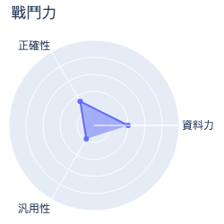
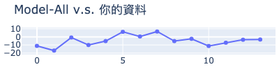
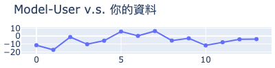
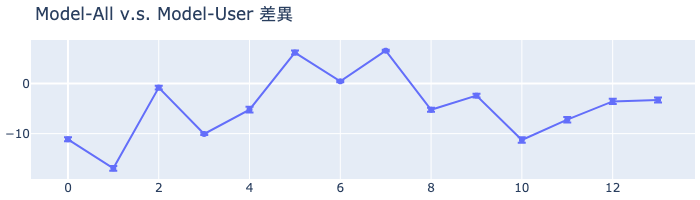

# MakerClub 咖啡粉偵測儀活動成績單 
| 活動時間: 2020/11/18<br>參加人名稱: **Celia**<br>模型名稱: **regression** |  |
|-----:|-------------:|
## 資料能力：
> 資料分數:91.82
>
> 排名:18/35 (*1)
### 貢獻訓練資料量:
> 	[★★★★★★★★★★★★★★☆☆☆☆☆☆☆☆☆☆☆☆☆☆☆☆☆☆☆☆☆]-(14/35)
### 資料對模型的乖離排名:
> 	[★★★★★★★★★★★★★★★☆☆☆☆☆]-(15/20) (*2)
>
> 	平均誤差值: -4.965
>
> 	誤差值標準差: 6.415
>
> 	誤差值全體學員平均標準差: 6.525
### 模型誤差圖(*3):
> 	|
### 模型能力差異
> 
### 量測資料
|    | id   |   rr |   rg |   rb |   rc |   value |
|---:|:-----|-----:|-----:|-----:|-----:|--------:|
|  0 | N1   |  120 |  172 |  163 |  485 |    72   |
|  1 | N2   |  138 |  184 |  169 |  523 |    90.2 |
|  2 | N3   |  123 |  175 |  166 |  496 |    62.4 |
|  3 | N5   |  103 |  162 |  157 |  453 |    56.9 |
|  4 | X07  |  181 |  219 |  192 |  627 |    98.6 |
|  5 | X14  |  130 |  185 |  174 |  522 |    56.1 |
|  6 | X15  |  100 |  164 |  160 |  456 |    40.9 |
|  7 | X16  |   99 |  166 |  163 |  459 |    32.2 |
|  8 | R1   |  200 |  229 |  196 |  660 |   108.2 |
|  9 | R1   |  200 |  229 |  196 |  660 |   105.4 |
| 10 | R4   |  152 |  193 |  174 |  551 |    93.9 |
| 11 | B1   |  156 |  195 |  175 |  558 |    92.9 |
| 12 | B2   |  156 |  196 |  175 |  560 |    88.6 |
| 13 | B9   |  148 |  190 |  173 |  543 |    83.4 |
## 附錄
* 模型評估說明：
  - 評估時，將對每位學員個別製作兩個模型，分別為：全體參加學員的資料訓練的模型(**Model-All**)與僅不使用你的資料去訓練的模型(**Model-User**)。
  - 假設**Model-All**對你貢獻的資料的平均誤差是6，而**Model-User**的平均誤差是11(大於6)，就表示你的資料對於模型的泛化能力有較高的機會提供了正向貢獻。
```
(*1) : 資料分數為你收集的資料對於整體模型的影響程度，越高分表示影響程度越高。
(*2) : 乖離排名的計算是由上述兩個模型分別進行預測，利用所得到的平均絕對誤差的差值做排名。
(*3) : 誤差值是模型對於你的資料所預測出來的數值與CM-100所測得的誤差。
```
