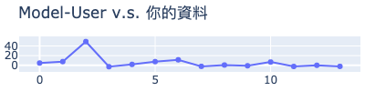

# MakerClub 咖啡粉偵測儀活動成績單
* 活動時間: 2020/11/18
* 參加人名稱: **Kelsen**
* 模型名稱: **mlp**
## 資料能力：
> 資料分數:99.81328225237837  
> 排名:7/35 (*1)
### 貢獻訓練資料量:
> [★★★★★★★★★★★★★★☆☆☆☆☆☆☆☆☆☆☆☆☆☆☆☆☆☆☆☆☆]-(14/35)
### 資料對模型的乖離排名:
> [★★★★★★★☆☆☆☆☆☆☆☆☆☆☆☆☆]-(7/20) (*2)
### 模型誤差圖(*3):
> 	|
## 附錄
* 模型評估說明：
  - 評估時，將對每位學員個別製作兩個模型，分別為：全體參加學員的資料訓練的模型(**Model-All**)與僅不使用你的資料去訓練的模型(**Model-User**)。
  - 假設**Model-All**對你貢獻的資料的平均誤差是6，而**Model-User**的平均誤差是11(大於6)，就表示你的資料對於模型的泛化能力有較高的機會提供了正向貢獻。
```
(*1) : 資料分數為你收集的資料對於整體模型的影響程度，越高分表示影響程度越高。
(*2) : 乖離排名的計算是由上述兩個模型分別進行預測，利用所得到的平均絕對誤差的差值做排名。
(*3) : 誤差值是模型對於你的資料所預測出來的數值與CM-100所測得的誤差。
```
