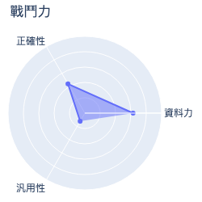

# MakerClub 咖啡粉偵測儀活動成績單 
| 活動時間: 2020/11/18<br>參加人名稱: **Norman**<br>模型名稱: **regression** |  |
|-----:|-------------:|
## 資料能力：
> 資料分數:94.38
>
> 排名:14/35 (*1)
### 貢獻訓練資料量:
> 	[★★★★★★★★★★★★★★★★★★★★★★☆☆☆☆☆☆☆☆☆☆☆☆☆]-(22/35)
### 資料對模型的乖離排名:
> 	[★★★★★★★★★★★★☆☆☆☆☆☆☆☆]-(12/20) (*2)
>
> 	平均誤差值: -1.732
>
> 	誤差值標準差: 8.051
>
> 	誤差值全體學員平均標準差: 6.525
### 模型誤差圖(*3):
> 	|
### 模型能力差異
> 
### 量測資料
|    | id   |   rr |   rg |   rb |   rc |   value |
|---:|:-----|-----:|-----:|-----:|-----:|--------:|
|  0 | N1   |  125 |  169 |  166 |  499 |    72   |
|  1 | N2   |  163 |  194 |  181 |  580 |    90.2 |
|  2 | N3   |  113 |  161 |  161 |  474 |    62.4 |
|  3 | N5   |  111 |  161 |  161 |  471 |    56.9 |
|  4 | N8   |  155 |  188 |  177 |  560 |    87.3 |
|  5 | N9   |  169 |  197 |  182 |  589 |    98.8 |
|  6 | N10  |  186 |  208 |  188 |  624 |   104   |
|  7 | X07  |  156 |  190 |  178 |  565 |    98.6 |
|  8 | X09  |  149 |  186 |  177 |  553 |    81.4 |
|  9 | X11  |  166 |  195 |  180 |  582 |    64.5 |
| 10 | X12  |  116 |  165 |  165 |  485 |    59.3 |
| 11 | X13  |  114 |  166 |  166 |  486 |    53.8 |
| 12 | X15  |  107 |  163 |  165 |  473 |    40.9 |
| 13 | R1   |  196 |  216 |  194 |  649 |   108.2 |
| 14 | R1   |  196 |  216 |  194 |  649 |   105.4 |
| 15 | R4   |  147 |  181 |  171 |  538 |    93.9 |
| 16 | R5   |  147 |  183 |  174 |  545 |    85.5 |
| 17 | B2   |  152 |  184 |  173 |  550 |    88.6 |
| 18 | B3   |  152 |  184 |  173 |  549 |    93.4 |
| 19 | B7   |  155 |  188 |  176 |  559 |    91.9 |
| 20 | B8   |  161 |  191 |  178 |  570 |    94.2 |
| 21 | B9   |  136 |  168 |  150 |  487 |    83.4 |
## 附錄
* 模型評估說明：
  - 評估時，將對每位學員個別製作兩個模型，分別為：全體參加學員的資料訓練的模型(**Model-All**)與僅不使用你的資料去訓練的模型(**Model-User**)。
  - 假設**Model-All**對你貢獻的資料的平均誤差是6，而**Model-User**的平均誤差是11(大於6)，就表示你的資料對於模型的泛化能力有較高的機會提供了正向貢獻。
```
(*1) : 資料分數為你收集的資料對於整體模型的影響程度，越高分表示影響程度越高。
(*2) : 乖離排名的計算是由上述兩個模型分別進行預測，利用所得到的平均絕對誤差的差值做排名。
(*3) : 誤差值是模型對於你的資料所預測出來的數值與CM-100所測得的誤差。
```
