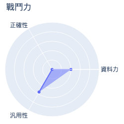
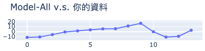
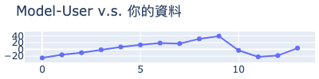
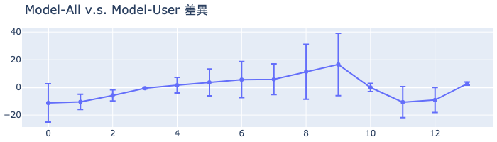

# MakerClub 咖啡粉偵測儀活動成績單 
| 活動時間: 2020/11/18<br>參加人名稱: **Training_data_gy33_v2**<br>模型名稱: **mlp** |  |
|-----:|-------------:|
## 資料能力：
> 資料分數:88.52
>
> 排名:17/35 (*1)
### 貢獻訓練資料量:
> 	[★★★★★★★★★★★★★★☆☆☆☆☆☆☆☆☆☆☆☆☆☆☆☆☆☆☆☆☆]-(14/35)
### 資料對模型的乖離排名:
> 	[★★★★★★★★★★★★★★☆☆☆☆☆☆]-(14/20) (*2)
>
> 	平均誤差值: 2.512
>
> 	誤差值標準差: 19.058
>
> 	誤差值全體學員平均標準差: 10.791
### 模型誤差圖(*3):
> 	|
### 模型能力差異
> 
### 量測資料
|    |   cr |   cg |   cb |   lux |   ct |   rr |   rg |   rb |   rc | label           |   value |   value_norm | description    |
|---:|-----:|-----:|-----:|------:|-----:|-----:|-----:|-----:|-----:|:----------------|--------:|-------------:|:---------------|
|  0 |   40 |   37 |   34 |    20 | 4629 |   98 |  116 |  100 |  340 | Extremely Light |   105.4 |     0.823438 | Norman #7      |
|  1 |   36 |   35 |   32 |    19 | 4777 |   88 |  110 |   97 |  320 | Extremely Light |    95   |     0.742188 | Norman #8      |
|  2 |   35 |   35 |   32 |    19 | 4874 |   87 |  110 |   97 |  319 | Very Light      |    88.8 |     0.69375  | Norman #9      |
|  3 |   32 |   33 |   31 |    17 | 5081 |   80 |  104 |   92 |  300 | Light           |    79.6 |     0.621875 | Norman #10     |
|  4 |   31 |   32 |   31 |    16 | 5201 |   76 |  103 |   93 |  296 | Medium Light    |    70.4 |     0.55     | Norman #11     |
|  5 |   30 |   32 |   31 |    16 | 5328 |   73 |  102 |   93 |  293 | Medium Light    |    63.8 |     0.498437 | Norman #12     |
|  6 |   28 |   31 |   30 |    16 | 5473 |   69 |   99 |   91 |  282 | Medium          |    57.9 |     0.452344 | Norman #13     |
|  7 |   29 |   32 |   31 |    16 | 5463 |   71 |  100 |   92 |  288 | Medium          |    59.9 |     0.467969 | Norman #14     |
|  8 |   26 |   30 |   30 |    15 | 5787 |   63 |   96 |   89 |  273 | Medium Dark     |    44.5 |     0.347656 | Norman #15     |
|  9 |   25 |   30 |   30 |    15 | 5963 |   61 |   95 |   89 |  269 | Dark            |    36.1 |     0.282031 | Norman #16     |
| 10 |   35 |   35 |   33 |    18 | 4983 |   87 |  111 |   98 |  321 | Very Light      |    81.8 |     0.639062 | La Minita      |
| 11 |   39 |   37 |   34 |    20 | 4712 |   96 |  116 |  100 |  336 | Extremely Light |   101.8 |     0.795312 | Shin Old       |
| 12 |   38 |   36 |   34 |    19 | 4799 |   94 |  115 |  100 |  334 | Extremely Light |    97.8 |     0.764062 | Jonny Kenya    |
| 13 |   33 |   33 |   32 |    17 | 5085 |   81 |  106 |   95 |  306 | Light           |    74.4 |     0.58125  | Jonny Ethiopia |
## 附錄
* 模型評估說明：
  - 評估時，將對每位學員個別製作兩個模型，分別為：全體參加學員的資料訓練的模型(**Model-All**)與僅不使用你的資料去訓練的模型(**Model-User**)。
  - 假設**Model-All**對你貢獻的資料的平均誤差是6，而**Model-User**的平均誤差是11(大於6)，就表示你的資料對於模型的泛化能力有較高的機會提供了正向貢獻。
```
(*1) : 資料分數為你收集的資料對於整體模型的影響程度，越高分表示影響程度越高。
(*2) : 乖離排名的計算是由上述兩個模型分別進行預測，利用所得到的平均絕對誤差的差值做排名。
(*3) : 誤差值是模型對於你的資料所預測出來的數值與CM-100所測得的誤差。
```
