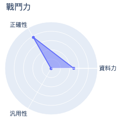
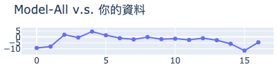
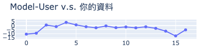
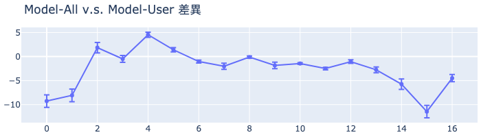

# MakerClub 咖啡粉偵測儀活動成績單 
| 活動時間: 2020/11/18<br>參加人名稱: **Training_data_gy33_v3**<br>模型名稱: **poly** |  |
|-----:|-------------:|
## 資料能力：
> 資料分數:98.78
>
> 排名:9/35 (*1)
### 貢獻訓練資料量:
> 	[★★★★★★★★★★★★★★★★★☆☆☆☆☆☆☆☆☆☆☆☆☆☆☆☆☆☆]-(17/35)
### 資料對模型的乖離排名:
> 	[★★★★☆☆☆☆☆☆☆☆☆☆☆☆☆☆☆☆]-(4/20) (*2)
>
> 	平均誤差值: -3.314
>
> 	誤差值標準差: 4.257
>
> 	誤差值全體學員平均標準差: 9.005
### 模型誤差圖(*3):
> 	|
### 模型能力差異
> 
### 量測資料
|    |   cr |   cg |   cb |   lux |   ct |   rr |   rg |   rb |   rc | label            |   value |   value_norm | description   |
|---:|-----:|-----:|-----:|------:|-----:|-----:|-----:|-----:|-----:|:-----------------|--------:|-------------:|:--------------|
|  0 |   48 |   42 |   36 |    24 | 4248 |  103 |  118 |  100 |  347 | Extremely light  |   109.2 |     0.853125 | SN1 :         |
|  1 |   49 |   43 |   36 |    25 | 4190 |  105 |  120 |  101 |  353 | Extremely light  |   107.3 |     0.838281 | SN2 :         |
|  2 |   46 |   41 |   35 |    23 | 4289 |   99 |  115 |   98 |  338 | Extremely light  |    97.7 |     0.763281 | SN3 :         |
|  3 |   45 |   41 |   35 |    23 | 4354 |   95 |  113 |   97 |  330 | Extremely light  |    96.1 |     0.750781 | SN4 :         |
|  4 |  nan |   40 |   34 |    22 | 4475 |   90 |  109 |   95 |  320 | light cr = 42,   |    85.7 |     0.669531 | SN5 :         |
|  5 |  nan |   39 |   34 |    22 | 4629 |   86 |  107 |   94 |  314 | light cr = 40,   |    82.5 |     0.644531 | SN6 :         |
|  6 |  nan |   37 |   33 |    20 | 4883 |   78 |  102 |   91 |  296 | light cr = 36,   |    75.7 |     0.591406 | N1 :          |
|  7 |   44 |   40 |   35 |    22 | 4421 |   94 |  112 |   97 |  329 | Extremely light  |    96.1 |     0.750781 | N2 :          |
|  8 |   33 |   35 |   32 |    19 | 5085 |   72 |   98 |   89 |  284 | Medium Light     |    65.6 |     0.5125   | N3 :          |
|  9 |   42 |   39 |   33 |    22 | 4384 |   91 |  109 |   94 |  320 | Extremely light  |    94.9 |     0.741406 | N4 :          |
| 10 |  nan |   34 |   31 |    18 | 5201 |   67 |   95 |   87 |  274 | Medium cr = 31,  |    57.8 |     0.451562 | N5 :          |
| 11 |   34 |   36 |   32 |    19 | 4874 |   74 |  100 |   90 |  289 | Medium Light     |    70.1 |     0.547656 | N6 :          |
| 12 |  nan |   37 |   33 |    20 | 4699 |   81 |  104 |   92 |  303 | light   cr = 38, |    79   |     0.617188 | N7 :          |
| 13 |   43 |   39 |   34 |    22 | 4403 |   92 |  111 |   96 |  325 | Extremely light  |    94.4 |     0.7375   | N8 :          |
| 14 |   47 |   41 |   35 |    23 | 4228 |  100 |  116 |   99 |  342 | Extremely light  |   105.1 |     0.821094 | N9 :          |
| 15 |   48 |   42 |   35 |    24 | 4169 |  103 |  118 |   99 |  347 | Extremely light  |   110   |     0.859375 | N10 :         |
| 16 |   43 |   39 |   34 |    22 | 4403 |   93 |  111 |   95 |  324 | Extremely light  |    99.5 |     0.777344 | N11 :         |
## 附錄
* 模型評估說明：
  - 評估時，將對每位學員個別製作兩個模型，分別為：全體參加學員的資料訓練的模型(**Model-All**)與僅不使用你的資料去訓練的模型(**Model-User**)。
  - 假設**Model-All**對你貢獻的資料的平均誤差是6，而**Model-User**的平均誤差是11(大於6)，就表示你的資料對於模型的泛化能力有較高的機會提供了正向貢獻。
```
(*1) : 資料分數為你收集的資料對於整體模型的影響程度，越高分表示影響程度越高。
(*2) : 乖離排名的計算是由上述兩個模型分別進行預測，利用所得到的平均絕對誤差的差值做排名。
(*3) : 誤差值是模型對於你的資料所預測出來的數值與CM-100所測得的誤差。
```
